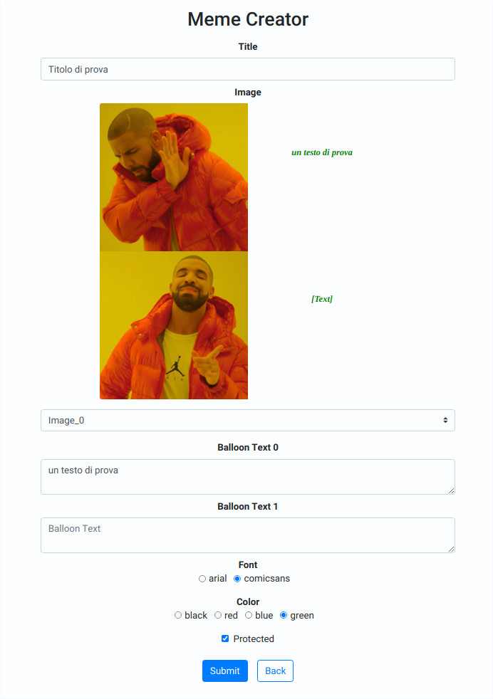

# Exam #2: "Generatore di meme"
## Student: s277970 Sottosanti Davide 

## React Client Application Routes

- Route `/`: it shows memes (public or all), user login/logout button and it allows to launch the procedure to show, add, clone or delete a meme
- Route `/memecreator`: it contains all fields the user has to fill in, in order to add a new meme. It manages the procedure for adding a new meme
- Route `/memecopy`: it contains all fields the user has to fill in, in order to copy a new meme. It manages the procedure for adding a copied meme
- Route `/memeinfo`: it shows full info of a meme, so it contains meme title, meme image and meme texts
- Route `/login`: it shows two text box to fill in with username and password, so it manages the login procedure

## API Server

- POST `/api/sessions`
  - <u>request</u> body content: users credentials [`username`, `password`]
  - <u>response</u> body content: user details [`id`, `username`, `name`] (it can return error details in the body)
- DELETE `/api/sessions/current`
  - <u>request</u> body content or parameters: none
  - <u>response</u> body content or parameters: none
- GET `/api/sessions/current`
  - <u>request</u> body content or parameters: none
  - <u>response</u> body content: user details [`id`, `username`, `name`] (it can return error details in the body)

- GET `/api/memes`
  - <u>request</u> body content or parameters: none
  - <u>response</u> body content: if the user is loggedin, it returns all memes. If the user is not loggedin, it returns public memes only. [`id`, `patternid`, `title`, `text`, `font`, `color`, `creator_id`, `creator_name`, `protected`]
- GET `/api/patterns`
  - <u>request</u> body content or parameters: none
  - <u>response</u> body content: it returns text position details for all memes (patterns).[`patternid_and_imagename`, `coordinates_preview`, `coordinates_full`] (*patternid_ and_imagename* is an integer used to build imagename too, *coordinates_preview* are texts cordinates for thumbnail and *coordinates_full* for full meme)
- POST `/api/memes`
  - <u>request</u> body content: [`patternid`, `title`, `text`, `font`, `color`, `protected`] (text is a string with all balloon texts, each one is separated by others using semicolon *text1;text2;text3..*)
  - <u>response</u> body content: none (it can return error details in the body)
- DELETE `/api/memes/:id`
  - <u>request</u> parameters: [`id`] (`id` is the id of the meme to delete)
  - <u>response</u> body content or parameters: none

## Database Tables

- Table `Memes` - contains [`id`, `patternid`, `title`, `text`, `font`, `color`, `creator_id`, `creator_name`, `protected`] (*it contains all memes created my users*)
- Table `Patterns` - contains [`patternid_and_imagename`, `coordinates_preview`,`coordinates_full`] (*it contains text position coordinates for each meme type*)
- Table `Users` - contains [`id`, `name`, `email`, `password`] (*it contains users details and credentials*)

## Main React Components

- `LoginForm` (in `MyLogin.js`): it handles the user login procedure. It gets user credentials, validates them and it sends credentials to server
- `MyMemeFull` (in `MyMemeFull.js`): it shows all details of a meme (title, image with text, creator name)
- `MyMemePreview` (in `MyMemePreview.js`): it shows thumbnail of a meme (with title, text, protected status label) and it contains buttons (to open meme info, to copy meme, to delete meme)
- `MyMemeCreator` (in `MyMemeCreator.js`): it handles the procedure for adding a new meme or copying an existing meme, it can auto-fill fields (copy mode) and show the final result in real-time

(only _main_ components, minor ones may be skipped)

## Screenshot

## Users Credentials

- [`aldo@polito.it`, `password11`] 

  Titles (and id) of memes created by **Aldo**:

   *Meme1 di Aldo* (<u>id:195</u>), *Meme2 di Aldo* (<u>id:198</u>), *Meme3 di Aldo (by copy)* (<u>id:201</u>)

- [`giovanni@polito.it`, `password22`] 

  Titles (and id) of memes created by **Giovanni**:

  *Meme1 di Giovanni* (<u>id:199</u>), *Meme2 di Giovanni* (<u>id:200</u>), *Meme3 di Giovanni (by copy)* (<u>id:202</u>)

- [`giacomo@polito.it`, `password33`] 

  Titles (and id) of memes created by **Giacomo**: 

  *Meme1 di Giacomo* (<u>id:203</u>), *Meme2 di Giacomo* (<u>id:204</u>), *Meme3 di Giacomo (by copy)* (<u>id:206</u>)
